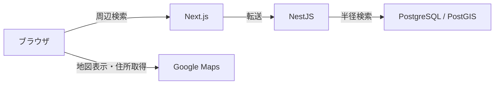

# プロジェクト構成

[READMEに戻る](../README.md)

## 処理の流れ

Next.jsが画面を担当し、入力検証とDB検索はNestJSに集約しています。住所取得はブラウザからGoogleへ直接行い、スポット検索とは独立して更新します。

## コードを読む入口

| 確認したいこと                       | 主なファイル                                                                       |
| ------------------------------------ | ---------------------------------------------------------------------------------- |
| 画面と地図・一覧の連動               | [spot-finder.tsx](../apps/web/src/features/spots/spot-finder.tsx)                  |
| 検索キャッシュ・通信中断             | [use-spot-search.ts](../apps/web/src/features/spots/use-spot-search.ts)            |
| 住所取得の頻度・応答順・タイムアウト | [use-center-address.ts](../apps/web/src/features/spots/use-center-address.ts)      |
| 検索条件の検証                       | [nearby-spots-query.schema.ts](../apps/api/src/spots/nearby-spots-query.schema.ts) |
| PostGISによる半径検索                | [spots.service.ts](../apps/api/src/spots/spots.service.ts)                         |
| CSV取込・テーブル・インデックス      | [20-init-spots.sql](../db/init/20-init-spots.sql)                                  |

画面の動作と工夫は [README](../README.md)、詳細な仕様の合意は [Issue #7（スポット検索）](https://github.com/otaki0413/spot-finder/issues/7)・[Issue #8（住所表示）](https://github.com/otaki0413/spot-finder/issues/8) を参照してください。
